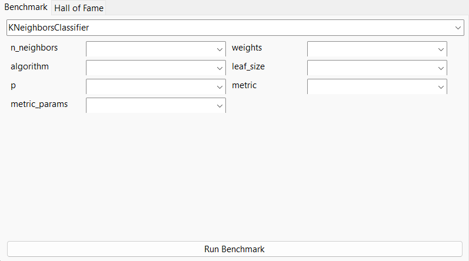
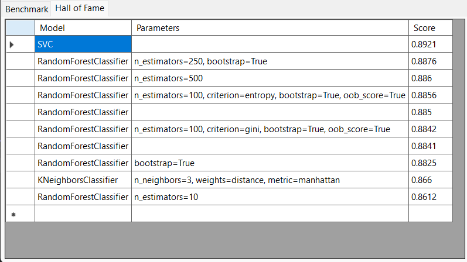

## About the project

ModelsBenchamrk is a simple app, which provides GUI wrapper for training and benchmarking sklearn models. 

Estimated accuracy for models for Fashion-MNIST (custom parameters and preprocessing methods didn't affect the score much).
- 89% - SVC
- 88,5% - RandomForestClassifier
- 86% - KNeighborsClassifier
- 84% - LogisticRegression

ModelBenchmark             |  Hall of Fame
:-------------------------:|:-------------------------:
  |  

## Built With

- C# - frontend
- Python + Flask - backend

## Roadmap

- [] Enable loading custom datasets
- [] Support for all sklearn models
- [] Support for preprocessing
